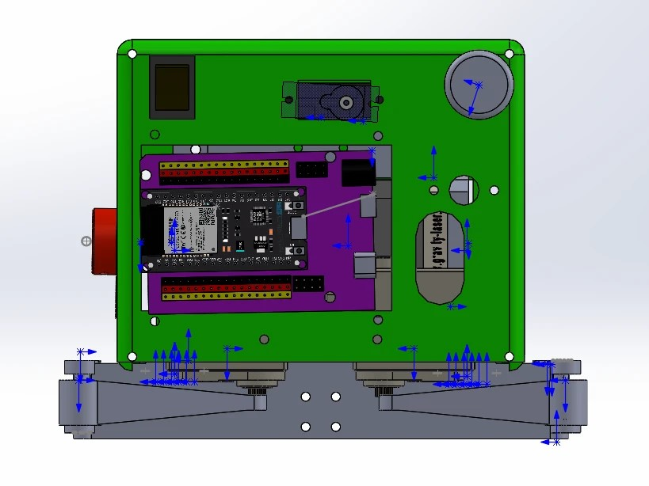

# Мой проект

## Виды модели

вид сверху

# Робот на ESP32 с шаговыми двигателями, дальномерами VL53L0X и сервоприводами

Проект представляет собой программируемого робота на базе ESP32, который выполняет движение по заданным маршрутам, управляет сервоприводами и избегает препятствий с помощью лазерных дальномеров. В репозитории также содержатся промежуточные тесты каждого из используемых компонентов.

## Структура репозитория
.
├── readme.md
├── code/
│ ├── 001_laserDistTest/ # тест одного дальномера VL53L0X
│ ├── 002_2laserDistTest/ # тест двух дальномеров
│ ├── 003_stepperTest/ # тест шаговых двигателей
│ ├── 004_buttonTest/ # тест кнопок
│ ├── 005_servoTest/ # тест сервоприводов
│ ├── 006_routeTest/ # тест движения по маршруту без дальномеров
│ └── 007_routeLaser/ # финальная программа (основной код)
└── images/
└── top.jpg # фото робота (вид сверху)

text

## Аппаратная часть

### Компоненты
- **ESP32** (любая плата с поддержкой Arduino)
- **2 шаговых двигателя** + драйверы (например, A4988)
- **2 дальномера VL53L0X** (лазерные, I2C)
- **3 сервопривода** (например, SG90 или MG995)
- **2 кнопки** (старт и выбор маршрута)

### Подключение

| Устройство | Пин ESP32 | Примечание |
|------------|-----------|-------------|
| **Мотор 1** STEP | 25 | |
| **Мотор 1** DIR  | 33 | |
| **Мотор 1** EN   | 14 | |
| **Мотор 2** STEP | 27 | |
| **Мотор 2** DIR  | 26 | |
| **Мотор 2** EN   | 32 | |
| **VL53L0X (левый)** SDA | 21 | |
| SCL | 22 | |
| XSHUT | 19 | После инициализации получает адрес 0x30 |
| **VL53L0X (правый)** XSHUT | 18 | Адрес 0x29 |
| **Серва 0** | 12 | **Внимание:** пин 12 – загрузочный. При проблемах со стартом ESP32 перенесите на другой. |
| **Серва 1** | 16 | |
| **Серва 2** | 17 | |
| **Кнопка STARTER** | 23 | подтяжка к GND (INPUT_PULLUP) |
| **Кнопка SIDE** | 13 | подтяжка к GND (INPUT_PULLUP) |

**Важно:**
- Сервы желательно питать от отдельного источника 5 В (общий GND с ESP32 и драйверами моторов).
- Шаговые двигатели **не включаются** при старте ESP32. Они активируются только в момент, когда маршрут доходит до шага движения (это сделано для безопасности и экономии энергии).

## Логика работы (финальная программа 007_routeLaser)

1. **При включении**:
   - Инициализируются дальномеры, настраиваются пины.
   - Кнопкой `SIDE` выбирается маршрут (если нажата – маршрут 2, иначе – маршрут 1).
   - Робот ждёт нажатия кнопки `STARTER`.

2. **После старта**:
   - Запускается таймер 98 секунд. Если маршрут не завершится за это время, робот останавливается и переходит в финальный режим серв.
   - Пошагово выполняются команды маршрута: движение, повороты серв, паузы.
   - На каждом шаге движения (если для шага включена защита `useDistanceSafety = true`) робот проверяет дальномеры. Если любое расстояние < 200 мм – движение приостанавливается до исчезновения препятствия.

3. **После завершения маршрута или по таймауту**:
   - Шаговые двигатели отключаются.
   - Две сервы (индексы 0 и 1) начинают плавно двигаться в противофазе (цикл 0°–180°), имитируя «махание» или сигнальную работу.

## Маршруты

В коде определены два маршрута (оба находятся в `007_routeLaser.ino`). Каждый шаг может быть одного из типов:

- `MOVE_STEPPERS` – перемещение на заданное число шагов (относительно текущего положения).
- `SERVO_MOVE` – поворот одной сервы на угол.
- `SERVO_MOVE_2` – одновременный поворот двух серв.
- `PAUSE_STEP` – задержка в миллисекундах.
- `END_ROUTE` – завершение маршрута.

**Маршрут 1 (пример)**:
1. Повернуть сервы 1 и 2 в крайние положения.
2. Проехать вперёд 1000 шагов (с защитой от препятствий).
3. Пауза 1 с.
4. Одновременно повернуть серву 0 на 40°, серву 1 на 140°.
5. Проехать 500 шагов (защита отключена – можно подъехать близко к объекту).
6. Изменить углы серв 0 и 1.
7. Отъехать назад 500 шагов.
8. Развернуться на месте (разность шагов -800 и 800).
9. Конец.

**Маршрут 2** – аналогичен, но включает другие движения и повороты. Детали смотрите в исходном коде.

## Промежуточные тесты

Папка `code/` содержит последовательные тесты, которые помогли отладить каждый компонент по отдельности:

- `001_laserDistTest` – чтение одного дальномера VL53L0X.
- `002_2laserDistTest` – работа двух дальномеров с разными I2C-адресами.
- `003_stepperTest` – управление двумя шаговыми двигателями (направление, скорость, ускорение).
- `004_buttonTest` – опрос кнопок с антидребезгом.
- `005_servoTest` – подключение и поворот серв.
- `006_routeTest` – движение по маршруту без использования дальномеров.
- `007_routeLaser` – финальная версия.

## Как использовать

1. Подключите аппаратуру согласно таблице выше.
2. Установите в Arduino IDE библиотеки:
   - [VL53L0X](https://github.com/pololu/vl53l0x-arduino)
   - [GyverStepper](https://github.com/GyverLibs/GyverStepper)
   - [ESP32Servo](https://github.com/madhephaestus/ESP32Servo)
3. Загрузите скетч `007_routeLaser.ino` в ESP32.
4. Откройте монитор порта (115200 бод) – будут видны отладочные сообщения.
5. Нажмите кнопку `SIDE` (если нужно выбрать маршрут 2) или отпустите её (маршрут 1).
6. Нажмите `STARTER` – робот начнёт выполнение.
7. Если потребуется остановить – перезагрузите ESP32.

## Фотографии

Вид сверху на робота:

*(Дополнительные фото можно добавить в папку `images` и вставить аналогично.)*

## Примечания

- Все тесты (`001_* ... 006_*`) являются независимыми. Их можно загружать по отдельности для проверки конкретного узла.
- В основном коде шаговые двигатели **включаются только в момент реального движения** (на шаге `MOVE_STEPPERS`). Это предотвращает нагрев драйверов и случайное движение.
- Сервы отключаются (`detach`) после каждого движения, чтобы не потреблять ток в статическом положении (исключение – финальный цикл).
- При использовании пина GPIO12 для сервы возможны проблемы с загрузкой ESP32. При необходимости переназначьте серву 0 на другой пин в массиве `SERVO_PINS`.

## Лицензия

Проект распространяется для образовательных и некоммерческих целей.